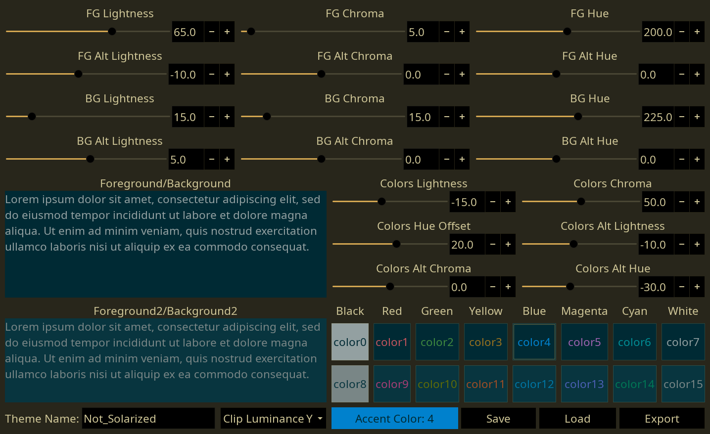

# color_thing
A thing that makes coordinated color themes.

### Requirements 
* Latest Python 3
* [Discount BABL] dropped into the same folder or added to PYTHONPATH
* PyGObject
* GTK+ 3

### Features
* Exporters for various programs
  * Alacritty
  * Dwarf Fortress
  * GIMP Palette
  * i3
  * Oomox (GTK 2/3)
  * Rofi
  * .Xresources
* LCH color space for prettiness
* Simple live previews
* Save/load to a text file

### To Do
* Exporters
  * Vim
  * ???
* A more intuitive UI for editing LCH values would be useful
* Shell interface?

### Exporter Format
Exporters are .py files placed in the `./exporters/` folder. color_thing automatically searches and loads any python modules in there, and adds entries to the export UI. The exporter requires the following to operate properly
* `NAME` global str. Name that shows up in the UI
* `FORMAT` global str. File format to save as. Use `"{name}.xxx"` to save as the theme name
* `EXPORT` function
  * Accepts a 16 Discount Babl colors as a `list`, the theme name as `str`, and the accent color index as an `int`
  * Returns `bytes` containing the binary data to write to the file

### FAQ
Question|Answer
--------|------
**Q.** WHY? This is so specific|**A.** ¯\\\_(ツ)_/¯

[Discount BABL]: https://github.com/Beinsezii/Discount-BABL
